# Architecture

English | [简体中文](../../zh-CN/development/architecture.md)

hk2's high-level architecture: the component layers, the data flow of a
request and of `/kb init`, the persisted directories, and each module's
responsibilities. This page describes boundaries and call relationships —
for behavior-level detail see the linked pages.

## Component map

```mermaid
flowchart TB
    subgraph CLI[CLI layer]
        BIN[bin/hk2] --> CLIJS[src/cli.js<br/>arg parse + dispatch]
    end
    subgraph Frontends[Interactive front-ends]
        REPL[src/commands/interactive.js<br/>line REPL]
        TUI[src/tui/*<br/>inline TUI]
        SERVE[src/commands/serve.js<br/>legacy REPL]
    end
    subgraph Slash[Slash commands]
        SI[src/slash/index.js<br/>registry + dispatcher] --> HELP[src/slash/help.js]
        SI --> MODEL[src/slash/model.js]
        SI --> PROJECT[src/slash/project.js]
        SI --> KB[src/slash/kb.js]
        SI --> SESSION[src/slash/session.js]
    end
    subgraph Turn[Turn pipeline]
        TURN[src/commands/turn.js<br/>runTurn]
        TSUP[src/commands/turn_support.js<br/>compact, kb update offer, reviews]
        SESSCTX[src/commands/session_ctx.js<br/>resume, fast lane, queueing]
        PHASEFB[src/phase_fallback.js]
    end
    subgraph AgentCore[Agent core]
        LOOP[lib/agent/loop.js<br/>agent loop]
        TOOLS[lib/agent/tools.js<br/>tool registry + KbFirstGuard]
        SYSP[lib/agent/system_prompt.js]
        GRAPH[lib/agent/graph.js<br/>per-request KB graph]
        PLANR[lib/agent/plan.js / plan_review.js / code_review.js]
        MCP[lib/agent/mcp.js]
        TR[lib/agent/transcript.js<br/>JSONL transcript]
        FACTS[lib/agent/session_facts.js<br/>compaction-immune session facts]
        TSTATE[lib/agent/task_state.js<br/>interrupted-task state]
    end
    subgraph StatusFmt[Shared status formatting]
        SF[src/commands/status_format.js<br/>status bar + plan progress]
    end
    subgraph Retrieval[Retrieval]
        RW[lib/retrieval/rewrite_query.js]
        CS[lib/retrieval/code_search.js]
        CB[lib/retrieval/context_builder.js]
        KBR[lib/retrieval/kb_runtime.js]
    end
    subgraph IndexGraph[Index and graph]
        IDX[lib/index/indexer.js]
        WALK[lib/index/walker.js]
        BM25[lib/index/bm25.js]
        GB[lib/graph/builder.js]
        GT[lib/graph/traverse.js]
        CKPT[lib/index/checkpoint.js]
        DGR[lib/index/doc_graph.js<br/>doc links / tables / doc-symbol refs]
        DIS[lib/store/doc_index_store.js<br/>doc_index.json]
    end
    subgraph Parsers[Parsers]
        AST[lib/parser/ast.js<br/>dispatcher]
        TSP[lib/parser/ts_parser.js<br/>tree-sitter]
        REGEX[lib/parser/c_parser / ylex_parser / generic_parser]
        DOCP[lib/parser/doc_parser.js]
    end
    subgraph Store[Store + config]
        KS[lib/store/kb_store.js / graph_store.js / supreme_code.js]
        HOME[lib/config/home.js]
        SET[lib/config/setting.js<br/>permissions]
    end
    subgraph LLM[LLM adapters]
        CLIENT[lib/llm/client.js]
        OA[lib/llm/openai_adapter.js]
        AA[lib/llm/anthropic_adapter.js]
        RETRY[lib/llm/retries.js / timeout.js / sse.js]
    end

    CLIJS --> REPL & TUI & SERVE
    REPL & TUI --> SI
    REPL & TUI --> TURN
    TURN --> RW & GRAPH & LOOP & TSUP & SESSCTX
    TURN --> FACTS
    TSUP -. compaction extraction .-> FACTS
    SI -. /remember /forget .-> FACTS
    SESSCTX -. digest consumes .-> FACTS
    TURN --> TSTATE
    REPL & TUI --> SF
    IDX --> DGR
    DGR --> DIS
    LOOP --> TOOLS
    TOOLS --> CS & KS & MCP
    GRAPH --> CS
    TURN --> SYSP
    TURN --> TR
    KB --> IDX
    IDX --> WALK & BM25 & GB & CKPT
    WALK --> AST
    AST --> TSP & REGEX
    IDX --> DOCP
    CS & GRAPH --> KBR
    LOOP --> CLIENT
    CLIENT --> OA & AA
    OA & AA --> RETRY
    SI --> HOME
    TOOLS --> SET
```



## Layers

- **CLI layer** — `bin/hk2` (single executable entry) imports
  `src/cli.js`, which parses argv and dispatches: `--version`/`--help`
  print-and-exit, `--project-list` one-shot, one-shot `--mode` commands
  (`build_kb.js`, `update_kb.js`), `--run-mode=serve` (legacy REPL), and
  the default interactive front-end (choice of TUI or line REPL, with TTY
  capability detection and fallback).
- **Interactive front-ends** — `src/commands/interactive.js` (line REPL:
  readline, status bar, tool cards) and `src/tui/*` (bordered input box,
  streaming markdown, modals). Both front-ends share one session object and
  delegate everything non-rendering: slash dispatch, the turn pipeline, the
  transcript.
- **Slash command layer** — `src/slash/index.js` registers the command
  table and tokenizes lines (shell-style quotes); `src/slash/help.js` is
  the single source of truth for per-command help and derived completions;
  per-family implementations (`model.js`, `project.js`, `kb.js`,
  `session.js`, `review.js`, `theme.js`) mutate the registries.
- **Turn pipeline** — `src/commands/turn.js` (`runTurn`) orchestrates one
  user message: gates, auto-compact, follow-up fast lane, query rewrite, KB
  retrieval, clarity assessment, system prompt build, the agent loop, and
  the end-of-turn sequence. `turn_support.js` (compact, kb-update offer,
  knowledge capture, reviews) and `session_ctx.js` (resume, fast-lane
  detection, mid-task queueing) carry the support flows;
  `phase_fallback.js` implements the phase-model fallback policy.
- **Agent core** — `lib/agent/loop.js` runs the LLM/tool rounds with
  caching and stuck detection; `tools.js` is the tool registry plus the
  KB-first guard; `system_prompt.js` builds the prompt (Supreme Code, when
  non-empty, before KB context); `graph.js` assembles the per-request KB
  graph; `plan.js`/`plan_review.js`/`code_review.js` implement planning and
  reviews; `mcp.js` attaches MCP tools; `transcript.js` writes the JSONL
  session transcript; `session_facts.js` maintains the compaction-immune
  `## Session facts` standing message (persisted as `<sid>.facts.json`);
  `task_state.js` persists interrupted-task state
  (`sessions/<projectId>/taskstate.json`) for `--resume` recovery.
- **Retrieval** — `lib/retrieval/` : `rewrite_query.js` (query rewrite +
  request assessment), `code_search.js` (BM25 search), `context_builder.js`
  and `kb_runtime.js` (in-memory KB cache and context assembly).
- **Parsers** — `lib/parser/ast.js` dispatches per extension: Tree-sitter
  (`ts_parser.js`) when available, else the regex fallbacks
  (`c_parser.js`, `ylex_parser.js`, `generic_parser.js`). `doc_parser.js`
  handles document formats into Eden entries.
- **Index / graph** — `lib/index/indexer.js` orchestrates a build (walk →
  parse → BM25 + graph + file/symbol registries), with `walker.js` (globs +
  `.gitignore`), `checkpoint.js` (resumable builds), `summarize.js` (LLM
  summaries), and `doc_graph.js` (document graph: Markdown links between
  docs, extracted tables and code blocks, doc↔doc and doc↔symbol
  references, persisted via `doc_index_store.js` as `doc_index.json`);
  `lib/graph/builder.js` builds nodes/edges from Symbols and `traverse.js`
  answers graph queries. `src/commands/status_format.js` is the shared
  formatting module behind the status bar and the plan-progress panel,
  used by both front-ends.
- **Store / config** — `lib/store/*` persists the KB (holy/eden entries,
  graph, indexes, supreme code); `lib/config/home.js` owns `HK2_HOME`,
  `models.json`, `projects.json`; `lib/config/setting.js` loads and resolves
  the filesystem permission rules.
- **LLM adapters** — `lib/llm/client.js` resolves a model config to a call;
  `openai_adapter.js` / `anthropic_adapter.js` speak the two wire protocols
  (including model-type feature mapping); `retries.js` / `timeout.js` /
  `sse.js` implement retry, timeout, and streaming parsing.

## Data flow: one request

1. Front-end reads a line → slash? dispatch → otherwise `runTurn`
   (`src/commands/turn.js`).
2. Gates (model, project, KB) → auto-compact check → follow-up fast lane
   (fast-lane turns skip steps 3's pipeline entirely).
3. Query rewrite (`rewrite_query.js`) → KB retrieval (`graph.js` over
   `code_search.js` + `kb_runtime.js`) → clarity assessment (optional menu
   → second rewrite/retrieve pass). Each stage is conditional: rewrite and
   assessment can be disabled via environment variables, and assessment
   runs only with a prompt-capable front-end.
4. System prompt build (`system_prompt.js`): identity → KB-first policy →
   tools → project info → Supreme Code → permission sandbox → KB context.
5. Agent loop (`loop.js`): stream reply, execute tool calls (`tools.js` /
   `mcp.js`), repeat; plan confirmations and `plan_step` surface through
   UI callbacks; mid-task input is injected at round boundaries.
6. Final answer → usage stats → transcript append.
7. End of turn (`turn_support.js`): kb-update offer, knowledge capture
   (`[kb learn]`), Holy-over-Eden conflict sync, optional code review.

## Data flow: `/kb init`

1. Resolve the current project → its globs and roots.
2. Walk files (`walker.js` + `gitignore.js`); parse each (`ast.js` →
   Tree-sitter or regex; documents via `doc_parser.js`).
3. Build the BM25 index (`bm25.js`), the graph (`graph/builder.js`), the
   file registry and sharded symbol table; checkpoint every N files
   (`checkpoint.js`).
4. Write everything under `~/.hk2/kb/<projectId>/` (`store/*`).
5. Optionally author the three LLM summary entries (`summarize.js`).

## Persisted state

Most configuration and session state lives under `HK2_HOME` (default
`~/.hk2`; the KB root itself can be relocated with `HK2_KB_DIR`) — see
[Configuration](../reference/configuration.md) for the full tree: the model
and project registries, permission rules, per-project KBs (including
`doc_index.json` and the per-space knowledge indexes), session transcripts,
per-session facts (`<sid>.facts.json`) and interrupted-task state
(`taskstate.json`), theme, input history, and logs.

## Source tree (condensed)

```text
hk2/
├── bin/hk2                    # executable entry
├── install.sh                 # installer
├── src/
│   ├── cli.js                 # arg parsing + dispatch
│   ├── version.js             # version from package.json
│   ├── phase_fallback.js      # phase-model fallback policy
│   ├── progress.js            # spinner/progress plumbing
│   ├── commands/              # REPL + turn pipeline (interactive, turn, serve, build_kb, ...)
│   ├── slash/                 # slash command layer (index, help, model, project, kb, session, review, theme, completions)
│   └── tui/                   # TUI front-end (index, input_box, keys, chrome, modal, history, completion, ...)
├── lib/
│   ├── agent/                 # loop, tools, system_prompt, graph, plan*, code_review, mcp, transcript, ...
│   ├── config/                # home.js (HK2_HOME), setting.js (permissions)
│   ├── parser/                # ast dispatcher, ts_parser, c/ylex/generic regex parsers, doc_parser
│   ├── index/                 # indexer, walker, gitignore, bm25, checkpoint, summarize, concurrency, ...
│   ├── graph/                 # builder, traverse
│   ├── retrieval/             # rewrite_query, code_search, context_builder, kb_runtime
│   ├── store/                 # kb_store, graph_store, supreme_code, doc_index_store, ...
│   ├── llm/                   # client, openai/anthropic adapters, retries, timeout, sse
│   └── util/                  # fs_atomic, lockfile, hash, log, async_pool
├── test/                      # node:test suites (see Testing and contributing)
├── scripts/                   # repo tooling
└── setting.example.json       # commented permission example
```

## Testing

The test suite is `node --test 'test/**/*.test.js'` (see
[Testing and contributing](testing-and-contributing.md)). Tests mirror the
module layout — parser, index, graph, permissions, slash commands, turn
pipeline, TUI (some via a PTY runner) — and are the fastest way to see
intended behavior when reading unfamiliar code.

## Related documentation

- [Agent workflow](../concepts/agent-workflow.md) — the turn pipeline in detail
- [Knowledge graph and retrieval](../concepts/knowledge-graph-and-retrieval.md) — the indexing pipeline
- [Configuration](../reference/configuration.md) — persisted state
