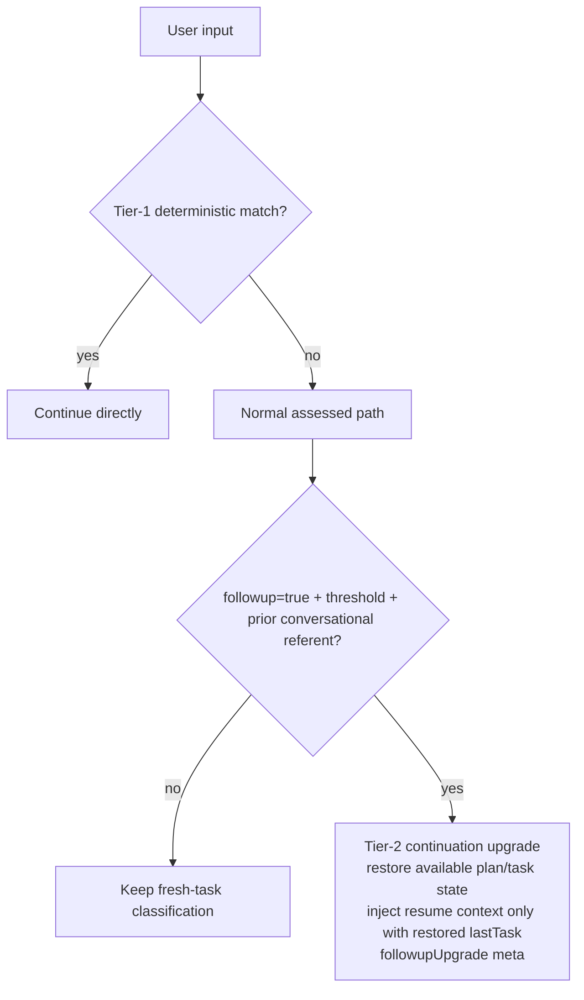

# Planning and review

English | [简体中文](../../zh-CN/guides/planning-and-review.md)

This guide explains hk2's planning and review machinery: when the agent
creates a plan, how interactive confirmation differs from non-interactive
auto-acceptance, the live progress panel, optional plan review and code review,
and what happens when a reviewer cannot produce a verdict. The gating
environment variables all default to **off**.

## Plans

The agent decides when to plan — there is no pre-execution plan pass. When
the model judges a task complex enough to benefit from an explicit strategy
decomposition (multiple distinct phases, a design choice, or several affected
subsystems), it calls the `plan` tool:

- a one-line summary, plus
- an intended shape of 2–5 ordered steps, each with 2–4 candidate
  strategies (one marked recommended) — the recommended shape the prompt
  asks for; runtime validation enforces only a minimum of two usable steps
  and two usable strategies per step, with no maximum.

Simple tasks skip `plan` entirely and execute directly.

### Confirmation

With an interactive confirmation callback, the plan surfaces as a menu: you
pick a strategy per step (or accept the recommended one), and the finalized
plan is returned as `{ confirmed:true, plan }`. Cancelling the menu returns
`{ cancelled:true, ... }`; the agent adapts. Without a confirmation callback,
the recommended strategy is auto-accepted and the result is
`{ confirmed:true, plan:..., autoAccepted:true }` — this is tool acceptance,
not user confirmation. In that mode there is no user menu or real progress
panel.

### The progress panel

Once an interactive plan is confirmed, a live panel is pinned above the
status bar:

```text
▣ Plan: sync README docs with code
  ✓ 1. Add missing plan_step tool
  ▶ 2. Document the progress panel
    3. Fix tree-sitter package count
    4. Commit and push
```

After finishing each confirmed step in interactive mode the agent calls
`plan_step` once; each call marks the CURRENT in-progress step done and
advances the panel — the `step` argument is accepted but deliberately ignored
for the mutation, so invalid, out-of-range, or out-of-order values never jump
steps. When the last step completes the panel clears automatically, and when
the turn ends normally a finalization pass clears any panel left un-advanced
(a backstop). Without a progress callback, `plan_step` only acknowledges the
reported completion and maintains no progress state or panel. Tasks that never
called `plan` never show a panel.

The panel survives interruption: interrupted-task state (original request,
summary, plan progress) is persisted, and `hk2 --resume` restores it (see
[Agent workflow](../concepts/agent-workflow.md#interruption-and-recovery)).

## Plan review

With `HK2_ENABLE_PLANREVIEW=1` (default off), after you confirm a plan an
LLM re-reviews the finalized plan before execution begins. The reviewer:

1. re-analyzes the requirement as a numbered checklist;
2. checks per-point coverage (which step covers each requirement —
   complete / partial / missing), ordering and contradictions, feasibility
   of each chosen strategy, and unstated risks and assumptions;
3. surfaces any issues one-by-one for confirmation — accept the reviewer's
   suggestion, dismiss it, or type your own. Confirmed resolutions are
   appended to the plan returned to the agent.

The reviewer's thinking stream renders live as `✎ thinking` (dim italic,
capped at 9 lines by default — `HK2_HIDE_THINKING=0` for the full stream),
followed by its analysis, which also streams. Reviews run with reasoning
enabled and no hk2-side deadline — hk2 does not cut the review off itself,
but you can still abort, and network failures, provider disconnects, or
process termination can still end it.

Plan review is active only in interactive TTY mode and is best-effort: any
failure returns the already-confirmed plan unchanged.

## Code review

Two forms exist, with distinct model-resolution paths:

- **Automatic** — `HK2_ENABLE_CODEREVIEW=1` (default off): on a normal agent
  return, finalization can review the completed result — the working-tree
  diff, changed files, and the agent's final summary — when this turn confirmed
  or continued a plan. A normal final text reply can therefore finalize a panel
  and trigger review even if the model did not call `plan_step` for every step.
- **Manual** — `/review code` reviews the original task request, queued
  mid-task additions that extended it, and the completed result; tool calls,
  reasoning, and intermediate turns are deliberately excluded. Its explicit
  `--model` fails fast when missing, while a stale project phase reference
  warns and uses the session model. The `lastCompletedTask` snapshot is
  in-memory only; `/session new` and resume clear it, and resumed sessions use
  deterministic transcript scanning. `/review plan` is reserved and not
  implemented yet.

### UNKNOWN verdicts

Only the machine-readable verdict JSON is parsed; it is never shown raw. A
reply whose verdict cannot be parsed is reported as **UNKNOWN** — never as
"no issues found". Treat UNKNOWN as "review inconclusive", not as success.

## Review models

Automatic and manual review use related but distinct model-resolution paths:

| Review path | Stale project phase ref | Explicit missing `--model` | Selected model call failure |
|---|---|---|---|
| Automatic plan/code review | silently use session model | n/a | warn + skip |
| Manual `/review code` | warn + use session model | abort | warn + skip |

Automatic review resolves a stale reference as no override, without warning or
fallback/skip audit event. A resolution exception warns and uses the session
model. Manual `/review code` warns for both a stale phase reference and a
resolution exception, then uses the session model; an explicit `--model=<ref>`
never falls back when its reference is invalid or missing. After any selected
review model is successfully resolved, an actual call failure skips the review
rather than selecting another model.


## Reasoning settings

- Reviews always run with reasoning enabled and no fixed timeout, regardless
  of the model's `--reasoning` flag.
- Request-clarity assessment is invoked with `enableReasoning:true`; this does
  not guarantee that every provider emits a separate reasoning stream. It is
  best-effort and uses `HK2_LLMAPI_TIMEOUT_MS_SIMPLE` — see
  [Environment variables](../reference/environment-variables.md).

## Continuation classification

hk2 uses two tiers rather than running an LLM classifier for every input:



`HK2_ENABLE_CONTINUATION_UPGRADE` defaults to on for inputs missed by tier 1
and depends on request assessment actually running. The threshold
`HK2_CONTINUATION_UPGRADE_MIN_CONFIDENCE` defaults to `0.6`, is parsed with
`parseFloat()`, and is clamped to `0–1` (invalid values use `0.6`). The
assessor must return `followup:true` with confidence at or above the threshold,
and a prior conversational referent must exist: a pre-commit plan, a
`lastTask`, or prior user/assistant messages. The upgrade reuses the existing
assessment result; it is not an additional LLM call. It restores only state
that exists: `planProgress` only when a pre-commit plan exists, `lastTask` only
when a pre-commit task exists, and resume context only when the restored
`lastTask` is non-empty. With conversation history alone there is no plan,
task anchor, or resume-context injection; the upgrade only avoids committing
the input as a fresh task snapshot. Tier-1 fast-lane inputs skip assessment
and do not use this upgrade.

## Interruption behavior

- `esc` aborts a running review like any turn phase; partial analysis stays
  on screen, and no verdict is recorded.
- An interrupted *task* keeps its plan progress; resume restores the panel
  and a continuation cue ("continue") injects the task state so the agent
  continues rather than restarting.
- A failed or UNKNOWN review never blocks the turn: the result is reported
  and the turn ends normally.

## Related documentation

- [Agent workflow](../concepts/agent-workflow.md) — where review sits in the pipeline
- [Models, projects, and sessions](models-projects-and-sessions.md) — phase models
- [Environment variables](../reference/environment-variables.md) — `HK2_ENABLE_PLANREVIEW`, `HK2_ENABLE_CODEREVIEW`, and friends
