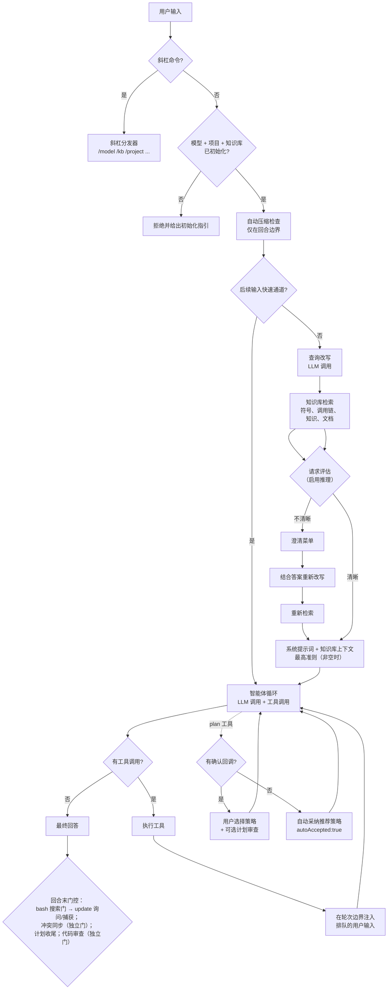

# 智能体工作流

[English](../../en/concepts/agent-workflow.md) | 简体中文

本页介绍从按下回车到得到最终回答的完整流程：智能体预处理流程（快速
通道、清晰度评估、查询改写、知识库检索）、带工具调用的智能体循环、规划
与审查，以及回合末知识捕获。这里描述的每个阶段都存在于当前代码中——主流程
位于 `src/commands/turn.js`（`runTurn`）。

## 总览

## 智能体预处理流程

在消息进入智能体循环前，hk2 会先运行一段有界的预处理流水线。斜杠命令会
直接执行，不经过这些步骤；明确的后续输入也可以跳过：

1. **门禁**——要求已配置模型且项目知识库已初始化，否则消息会被拒绝并给出
   初始化指引。知识库门禁会先重新读取注册表，因此在其他终端注册的项目
   无需重启即可被发现。
2. **自动压缩检查**——在回合**开始时**（安全边界），若
   `HK2_ENABLE_AUTOCOMPACT=1`（默认开启）且上一回合结束时的上下文使用率
   达到 `HK2_AUTOCOMPACT_PCTUSED`%（默认 90），则压缩历史对话：最近 4 条
   user/assistant **消息**原样保留（这里保留的是消息而非完整回合，交替对话约等于
   两轮往返），更早的对话（含工具结果）由 LLM 总结为一条
   system 消息，失败时回退为朴素截断。在对话被压缩总结之前，用户陈述的
   持久事实会先被抽取进会话事实存储（尽力而为、失败即放行），且摘要器输入
   同时保留对话开头和结尾，使开头陈述的事实进入摘要。经 `/remember` /
   `remember` 工具显式保存的事实必然免受压缩；自动抽取则是尽力而为。
   这种按阈值触发的检查不会中断正在执行的任务。另有一条错误恢复路径：若提供商
   在任务执行中因上下文过长而拒绝请求，hk2 会在中断点压缩对话、注入恢复上下文，
   然后重新运行智能体循环。每回合最多恢复两次；其他类型的错误不会通过压缩重试。
3. **后续输入快速通道**（`HK2_ENABLE_FOLLOWUP_FASTLANE`，默认开启）——
   被确定为会话性后续输入的内容会跳过整个预处理流程，直接进入智能体循环（循环
   可见完整对话）。符合条件的内容：继续指令（“continue”、“请继续”）、纯
   确认词（“ok”、“好的”）、助手刚显示编号菜单时输入的纯数字选择、有活跃
   计划时的推进指令（“执行下一步”）。
4. **查询改写**（`HK2_ENABLE_QUERYREWRITE`，默认开启）——模型将查询改写为
   英文函数名和关键词，用于 BM25 检索。可通过 `rewrite-query` 为此阶段
   配置专用模型；如果该模型无法访问，`HK2_ENABLE_PHASEMODEL_FALLBACK`（默认开启）
   会改用会话主模型重试，设为 0 则跳过。如果失效的模型引用解析为 `null`，
   则不发出警告，直接使用会话模型；如果解析过程抛出异常，则发出警告并使用
   会话模型。之后若用户补充了澄清信息，还会在当前回合结合这些信息再次改写查询。
5. **知识库检索**——使用改写后的查询检索相关符号、调用图邻居、2 跳调用链、
   类成员、知识条目（Holy 优先）、项目文档与结构化文档表格
   （`lib/agent/graph.js`）。
   Holy 与 Eden 的冲突在此检测——检索后立即打印抑制提示——而
   `supersededBy` 标记与同步报告在回合末进行。
6. **请求清晰度评估**（`HK2_ENABLE_REQUEST_ASSESS`，默认开启）——模型在限定的
   调用预算内判断请求是否清晰，判断依据*包含会话上下文*（可用的任务上下文、活跃
   计划、助手最近消息、近期对话回合、已记录的会话事实），以降低脱离上下文造成
   的误判；评估仍是 LLM 判断，并非保证。若已配置的评估阶段模型不可达，同一回退
   策略可能在会话主模型上重试一次。hk2 始终对该评估请求 `enableReasoning:true`，但这不保证
   每个提供商都会返回独立 reasoning 流。不清晰的请求弹出编号澄清菜单（含
   自由文本“其他”选项）；选定的答案会反馈到第二次改写 + 检索。低置信度的
   “不清晰”结论（低于 `HK2_ASSESS_MIN_CONFIDENCE`，默认 0.8）按清晰处理；
   任何失败都回退到正常改写流程——评估是尽力而为的。

   评估结果还会用于 tier-2 continuation upgrade。当 tier 1 未将输入判定为
   后续内容时，如果满足 `HK2_ENABLE_CONTINUATION_UPGRADE=1`、置信度达到
   `HK2_CONTINUATION_UPGRADE_MIN_CONFIDENCE`（默认 `0.6`），并且存在可供后续输入
   引用的既有会话上下文（pre-commit plan、`lastTask` 或历史 user/assistant
   消息），就可能触发 tier-2 continuation upgrade。升级复用评估结果，只恢复实际存在
   的 plan/task 状态；只有恢复后的 `lastTask` 非空时才注入恢复上下文，并记录
   `followupUpgrade`；它不增加额外 LLM 调用。仅有历史对话时不会注入恢复
   上下文。

## 系统提示词与知识库上下文

系统提示词按固定章节顺序构建（`lib/agent/system_prompt.js`）：

1. 智能体身份、工作风格与规划指令
2. 知识库优先策略与首选的知识库工具
3. 可用工具与使用准则
4. 工作目录与项目信息
5. `# Project Supreme Code (MUST OBEY — never violate)`——仅在条目非空时
   渲染，始终在**所有**其他注入上下文之前（模型层遵从；条目本身的存储
   保护才是硬限制）
6. `# Filesystem permission sandbox`——生效的权限摘要
7. `# Knowledge-base context`——按请求的检索结果
8. 项目上下文文件（如 README）以及末尾追加的内容

知识库上下文块在第一回合进入系统提示词，之后各回合进入一条专用的回合 system
消息。源文件读取被拒绝时，不会注入对应镜像文件的内容（见
[安全与权限](../guides/security-and-permissions.md)）。

另一条常驻消息——`## Session facts`——会在每一回合紧跟主系统提示词出现，
在设计上免受压缩影响：经 `/remember` 或 `remember` 工具显式保存（且成功
落盘）的事实始终保留；而抢救“即将被总结掉的事实”的压缩时抽取属于
尽力而为——不保证早期陈述一定被捕获。见
[斜杠命令](../reference/slash-commands.md#remember)。

## 智能体循环

循环（`lib/agent/loop.js`）流式接收模型回复，执行其中的工具调用，将结果
填回上下文，重复这一过程，直到模型不再调用工具而直接作答。护栏包括：

- **工具结果缓存**——同一 `runLoop` 内完全相同的只读工具调用复用结果；
  bash/edit/write/ast_edit/resolve 会清空缓存（`kb_save_knowledge` 不会，
  见工具参考）。
- **卡死检测**——同一工具调用签名与结果指纹连续出现时，首次不计为重复，
  其后再重复三次（即第四个相同轮次）时中止；另有 1000 轮的绝对上限。代码中
  存在 `NO_PROGRESS_TURNS`（连续 6 轮无进展）守卫，但其条件要求零待处理工具调用——该情形会先行
  正常返回，因此该守卫当前不可达，请勿依赖它。
- **任务中输入排队**——回合运行期间输入的纯文本会进入队列，在下一个轮次
  边界作为任务内指引注入（当前动作完成后、下一次 LLM 调用前），合并为
  一条消息；斜杠命令等待回合结束。在正常结束回合时，运行期间未能送达的内容
  会成为新回合——不会丢失（进程崩溃或被强杀不在保证范围内）。
  见 [REPL 与 TUI](../guides/repl-and-tui.md)。

### LLM 重试边界

LLM 重试只重启当前 LLM 调用。失败 attempt 的正文 delta、推理缓冲区与尚未
执行的工具调用会被丢弃；此前已经成功完成的工具轮次文本会作为独立 assistant
消息保留在会话记录和重放上下文中。`session.lastAnswer` 与代码审查输入只使用
最终、不含工具调用的 assistant 答案，不会拼接此前的轮次消息。用量统计仍
可能保留不同 attempt 的峰值，因此也不宣称它等于“仅计最终一次尝试”或
“全部计费尝试总量”。

完整工具注册表见[智能体工具](../reference/agent-tools.md)。

## 规划

规划由 `plan` 工具驱动、由模型决定：当模型判定任务足够复杂、适合显式拆分
策略（多个独立阶段、设计选择或涉及多个子系统）时，智能体可以调用 `plan` 提交一行
摘要和分步计划。建议计划包含 2–5 个有序步骤，每步含 2–4 个候选策略（一个标记为推荐）。
实际处理计划时，只要求至少 2 个可用步骤、每步至少 2 个有名称的策略，不限制
步骤和策略的数量上限。未设置推荐项或设置了多个推荐项时，会自动调整为一个。简单任务直接执行。存在交互式确认回调时，
用户在菜单中逐步选择策略，确认后的计划由 `plan_step` 推进实时进度面板；没有该
回调时自动采纳推荐策略并返回 `autoAccepted:true`，不维护真实进度面板。详见
[规划与审查](../guides/planning-and-review.md)。

## 回合末

最终回答流式输出完毕（会话记录已追加）后，hk2 按固定顺序执行：

1. **自动知识库更新 / `[kb learn]` 询问**——这一整块**只有在本回合记录到
   符合条件的 bash 源码搜索**（grep/find/cat 类命令作用于源文件）时才
   执行；没有此类回退记录则整块不运行。运行时：
   `HK2_ENABLE_AUTOUPDATEKB=1` 触发静默增量 `/kb update`；否则提示 y/N。
2. **知识捕获**——只能经上一块进入，且当智能体本回合已保存知识（通过
   `kb_save_knowledge`）或在 `HK2_KB_LEARN_COOLDOWN_MIN` 窗口内已处理过
   捕获时跳过。一次 LLM 抽取调用生成候选条目；`HK2_KB_LEARN_VALIDATE=1` 时
   先对照现有知识库校验（重复 → 跳过，相近 → 合并，冲突 → 裁决）。Eden
   条目在 `HK2_ENABLE_AUTO_LEARN=1` 时自动提交（否则 y/N）；**Holy 始终
   提示 y/N**。
3. **冲突同步**——与上面两条独立的流程：与 Holy 条目冲突的 Eden 条目被
   标记 `supersededBy: "holy:<id>"`。
4. **代码审查**——另一条独立流程，受 `HK2_ENABLE_CODEREVIEW=1` 门控：
   循环正常返回后，当本回合涉及计划（或从继续计划开始），且计划面板已在
   正常完成路径中被兜底收尾时，审查者检查工作区 diff、变更文件与最终总结（见
   [规划与审查](../guides/planning-and-review.md)）。是否触发并不严格取决于
   模型是否为每一步调用了 `plan_step`——返回即收尾的兜底会清除残留面板，
   这也接受“模型中途以正常文本提问会清掉面板”的现状。

## 中断与恢复

全新启动（不带 `--resume`）也可以加载项目已保存的任务锚点，但会暂存未完成
计划，不立即显示面板。REPL/TUI 会显示 `[recovery]` 提示。首个智能体回合中，
`continue`（或 tier-2 continuation upgrade）会激活该计划；新任务会丢弃
暂存计划。斜杠命令本身不消耗智能体回合。替换会话或切换项目会清除旧的待恢复
状态。这种轻量恢复不重放之前的对话；需要重放会话记录并按会话 ID 匹配任务
状态时，请使用 `--resume`。

- **中断**——回合运行中按 `esc`（或 Ctrl+C）中止在途的 LLM 调用与工具
  轮次。已流出的部分回答仍保留在终端画面上，但**不会**作为完整的
  assistant 回合写入会话记录；悬空的工具调用被清理。中断任务状态
  （原始请求、摘要、计划进度）以原因 `interrupted` 持久化。
- **恢复**——同一会话中输入继续指令（“continue”）会注入已保存的任务状态，
  智能体继续而不是从头开始。重启后 `hk2 --resume` 重放会话记录*并*恢复
  中断任务状态与进度面板。已完成的计划会清除状态，之后的“continue”是全新
  请求。

## 相关文档

- [知识图谱与检索](knowledge-graph-and-retrieval.md)——检索到底查询了什么
- [规划与审查](../guides/planning-and-review.md)——计划、计划审查、代码审查
- [环境变量](../reference/environment-variables.md)——控制各阶段的开关
