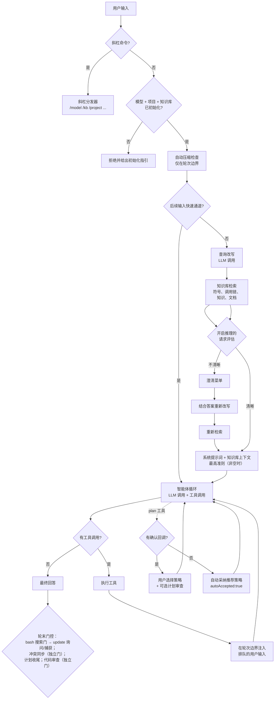

# 智能体工作流

[English](../../en/concepts/agent-workflow.md) | 简体中文

本页解释从按下回车到得到最终回答之间发生的一切：智能体前置管线（快速
通道、清晰度评估、查询改写、知识库检索）、带工具调用的智能体循环、规划
与审查，以及轮末知识捕获。这里描述的每个阶段都存在于当前代码中——主流程
位于 `src/commands/turn.js`（`runTurn`）。

## 总览

## 智能体前置管线

在智能体循环看到消息之前，hk2 运行一段有界管线。斜杠命令会跳过全部管线
（直接分发），明确的后续输入也可以跳过：

1. **门禁**——要求已配置模型且项目知识库已初始化，否则消息被拒绝并给出
   初始化指引。知识库门禁会先重新解析注册表，因此在其他终端注册的项目
   无需重启即可被发现。
2. **自动压缩检查**——在轮次**开始时**（安全边界，绝不中途触发）：若
   `HK2_ENABLE_AUTOCOMPACT=1`（默认开启）且上一轮结束时的上下文使用率
   达到 `HK2_AUTOCOMPACT_PCTUSED`%（默认 90），则压缩历史对话：最近 4 条
   user/assistant **消息**原样保留（是消息而非完整轮次——交替对话约等于
   两个来回），更早的对话（含工具结果）由 LLM 总结为一条
   system 消息，失败时回退为朴素截断。在对话被总结掉之前，用户陈述的
   持久事实会先被抽取进会话事实层（尽力而为、失败即放行），且摘要器输入
   同时保留对话的头部与尾部，使开头陈述的事实进入摘要。经 `/remember` /
   `remember` 工具显式保存的事实必然免受压缩；自动抽取则是尽力而为。
3. **后续输入快速通道**（`HK2_ENABLE_FOLLOWUP_FASTLANE`，默认开启）——
   确定为会话性后续输入的内容跳过整个前置管线，直接进入智能体循环（循环
   可见完整对话）。符合条件的内容：继续指令（"continue"、"请继续"）、纯
   确认词（"ok"、"好的"）、恰逢助手刚给出编号菜单时的纯数字选择、有活跃
   计划时的推进指令（"执行下一步"）。
4. **查询改写**（`HK2_ENABLE_QUERYREWRITE`，默认开启）——一次 LLM 调用把
   查询改写为英文函数名 + 关键词用于 BM25 检索。阶段模型
   （`rewrite-query`）可驱动该调用；该模型成功解析后若实际调用失败，
   `HK2_ENABLE_PHASEMODEL_FALLBACK`（默认开启）让阶段改用会话主模型重跑，
   设为 0 则跳过。解析为 `null` 的过期 ref 会静默视为无覆盖，而解析异常
   会告警并使用会话模型。
5. **知识库检索**——改写后的查询检索相关符号、调用图邻居、2 跳调用链、
   类成员、知识条目（Holy 优先）与项目文档（`lib/agent/graph.js`）。
   Holy 与 Eden 的冲突在此检测——检索后立即打印抑制提示——而
   `supersededBy` 标记与同步报告在轮末进行。
6. **请求清晰度评估**（`HK2_ENABLE_REQUEST_ASSESS`，默认开启）——一轮
   有界 LLM 判断请求是否清晰，判断依据*包含会话上下文*（在途任务、活跃
   计划、助手最近消息、近期对话轮次、已记录的会话事实），因此真正的后续
   输入不会被误判。不清晰的请求弹出编号澄清菜单（含自由文本"其他"
   选项）；选定的答案会反馈到第二次改写 + 检索。低置信度的"不清晰"结论
   （低于
   `HK2_ASSESS_MIN_CONFIDENCE`，默认 0.8）按清晰处理；任何失败都回退到
   正常改写流程——评估是尽力而为的。hk2 始终请求 `enableReasoning:true`，但
   这不保证每个提供商都会返回独立 reasoning 流。当 tier 1 没有把输入分类为
   后续时，已有评估结果可能在 `HK2_ENABLE_CONTINUATION_UPGRADE=1`、置信度达到
   `HK2_CONTINUATION_UPGRADE_MIN_CONFIDENCE`（默认 `0.6`）且存在进行中任务时
   驱动 tier-2 continuation upgrade。升级复用评估结果，恢复原始任务状态，注入
   恢复上下文并记录 `followupUpgrade`；它不增加额外 LLM 调用。

## 系统提示词与知识库上下文

系统提示词按固定章节顺序构建（`lib/agent/system_prompt.js`）：

1. 智能体身份、工作风格与规划指令
2. 知识库优先策略与首选的知识库工具
3. 可用工具与使用准则
4. 工作目录与项目信息
5. `# Project Supreme Code (MUST OBEY — never violate)`——仅在条目非空时
   渲染，始终在**所有**其他注入上下文之前（模型层遵从；条目本身的存储
   保护才是硬限制）
6. `# Filesystem permission sandbox`——生效的权限摘要
7. `# Knowledge-base context`——按请求的检索结果
8. 项目上下文文件（如 README）与附加尾部

知识库上下文块在第一轮进入系统提示词，之后各轮进入一条专用的轮次 system
消息。镜像真实文件的内容在源文件被拒绝读取时会被抑制（见
[安全与权限](../guides/security-and-permissions.md)）。

另一条常驻消息——`## Session facts`——紧跟主系统提示词之后出现在每一轮，
在设计上免受压缩影响：经 `/remember` 或 `remember` 工具显式保存（且成功
落盘）的事实被确定性保留；而抢救"即将被总结掉的事实"的压缩时抽取属于
尽力而为——不保证早期陈述一定被捕获。见
[斜杠命令](../reference/slash-commands.md#remember)。

## 智能体循环

循环（`lib/agent/loop.js`）流式接收模型回复，执行其中工具调用，把结果
回填，重复直到模型不再调用工具直接作答。护栏包括：

- **工具结果缓存**——同一 `runLoop` 内完全相同的只读工具调用复用结果；
  bash/edit/write/ast_edit/resolve 会清空缓存（`kb_save_knowledge` 不会，
  见工具参考）。
- **卡死检测**——同一工具调用签名与结果指纹连续出现时，首次不计为重复，
  其后再重复三次（即第四个相同轮次）时中止；另有 1000 轮绝对上限。代码中
  存在 `NO_PROGRESS_TURNS`（连续 6 轮无进展）守卫，但其条件要求零待处理工具调用——该情形会先行
  正常返回，因此该守卫当前不可达，请勿依赖。
- **任务中输入排队**——回合运行期间输入的纯文本进入队列，在下一个轮次
  边界作为任务内指引注入（当前动作完成后、下一次 LLM 调用前），合并为
  一条消息；斜杠命令等待回合结束。在正常的回合结束路径上，未能在运行中
  送达的内容会成为新回合——不会丢失（进程崩溃或被强杀不在保证范围内）。
  见 [REPL 与 TUI](../guides/repl-and-tui.md)。

### LLM 重试边界

LLM 重试只重启当前 LLM 调用。失败 attempt 的正文 delta、推理缓冲区与尚未
执行的工具调用会被丢弃；此前已经成功完成的工具轮次文本会保留。会话记录、
`session.lastAnswer` 与代码审查输入使用清理后的 assistant 文本。用量统计仍
可能保留不同 attempt 的峰值，因此不宣称它只统计最终 attempt 或完整计费总量。

完整工具注册表见[智能体工具](../reference/agent-tools.md)。

## 规划

规划由 `plan` 工具驱动、由模型决定：当模型判定任务足够复杂、适合显式拆分
策略（多个独立阶段、设计选择或涉及多个子系统）时，它调用 `plan` 提交一行
摘要与 2–5 个有序步骤，每步含 2–4 个候选策略（一个标记为推荐）。简单任务
直接执行。存在交互式确认回调时，用户在菜单中逐步选择策略，确认后的计划由
`plan_step` 推进实时进度面板；没有该回调时自动采纳推荐策略并返回
`autoAccepted:true`，不维护真实进度面板。详见[规划与审查](../guides/planning-and-review.md)。

## 轮末

最终回答流式输出完毕（会话记录已追加）后，hk2 按固定顺序执行：

1. **自动知识库更新 / `[kb learn]` 询问**——这一整块**仅当本轮记录到
   符合条件的 bash 源码搜索**（grep/find/cat 类命令作用于源文件）时才
   执行；没有此类回退记录则整块不运行。运行时：
   `HK2_ENABLE_AUTOUPDATEKB=1` 触发静默增量 `/kb update`；否则提示 y/N。
2. **知识捕获**——只能经上一块进入，且当智能体本轮已保存知识（通过
   `kb_save_knowledge`）或在 `HK2_KB_LEARN_COOLDOWN_MIN` 窗口内已处理过
   捕获时跳过。一次 LLM 抽取调用提出条目；`HK2_KB_LEARN_VALIDATE=1` 时
   先对照现有知识库校验（重复 → 跳过，相近 → 合并，冲突 → 裁决）。Eden
   条目在 `HK2_ENABLE_AUTO_LEARN=1` 时自动提交（否则 y/N）；**Holy 始终
   提示 y/N**。
3. **冲突同步**——与上面两条独立的流程：与 Holy 条目冲突的 Eden 条目被
   标记 `supersededBy: "holy:<id>"`。
4. **代码审查**——另一条独立流程，受 `HK2_ENABLE_CODEREVIEW=1` 门控：
   循环正常返回后，当本轮涉及计划（或从继续计划开始）且计划面板已被
   正常完成兜底收尾时，审查者检查工作区 diff、变更文件与最终总结（见
   [规划与审查](../guides/planning-and-review.md)）。触发并不严格依赖
   模型为每一步调用了 `plan_step`——返回即收尾的兜底会清除残留面板，
   这也接受"模型中途以正常文本提问会清掉面板"的现状。

## 中断与恢复

- **中断**——回合运行中按 `esc`（或 Ctrl+C）中止在途的 LLM 调用与工具
  轮次。已流出的部分回答仍保留在终端画面上，但**不会**作为完整的
  assistant 轮次写入会话记录；悬空的工具调用被清理。中断任务状态
  （原始请求、摘要、计划进度）以原因 `interrupted` 持久化。
- **恢复**——同一会话中输入继续指令（"continue"）会注入已保存的任务状态，
  智能体继续而不是从头开始。重启后 `hk2 --resume` 重放会话记录*并*恢复
  中断任务状态与进度面板。已完成的计划会清除状态，之后的"continue"是全新
  请求。

## 相关文档

- [知识图谱与检索](knowledge-graph-and-retrieval.md)——检索到底查询了什么
- [规划与审查](../guides/planning-and-review.md)——计划、计划审查、代码审查
- [环境变量](../reference/environment-variables.md)——控制各阶段的开关
