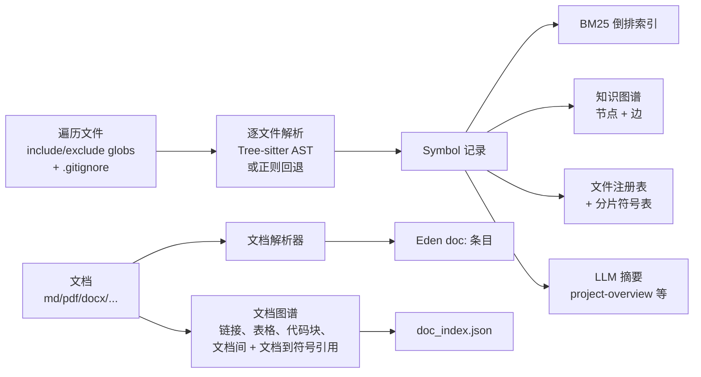

# 知识图谱与检索

[English](../../en/concepts/knowledge-graph-and-retrieval.md) | 简体中文

本页解释 hk2 如何把源码树变成可检索的知识库：文件扫描、带正则回退的
Tree-sitter AST 解析、符号模型、BM25 索引、代码知识图谱，以及按请求检索
如何为智能体提供上下文。

## 索引管线

`/kb init`（以及增量 `/kb update`）执行以下管线：



1. **文件扫描**——`lib/index/walker.js` 遍历项目根，遵循 include/exclude
   globs（默认覆盖常见源码与文档扩展名）与 `.gitignore` 规则
   （`lib/index/gitignore.js`）。项目注册的 `sourceRoot` 与额外根都会被
   遍历。
2. **解析**——`lib/parser/ast.js` 按文件扩展名分发。Tree-sitter 原生绑定
   可用且存在对应语法时，`lib/parser/ts_parser.js` 执行 AST 遍历；否则
   回退到专用正则解析器（C/C++、lex/yacc）或通用正则解析器。文档
   （Markdown、JSON、YAML、HTML、SGML、PDF、Word、PowerPoint、纯文本）
   经 `lib/parser/doc_parser.js` 处理，以 `doc:<relpath>` 条目归入 Eden
   空间。
3. **符号提取**——每条源码解析路径都返回统一形状的 `Symbol[]`：名称、种类
   （函数 / 方法 / 类 / 接口 / 结构体 / 字段）和行范围；签名以及 `qualName`、
   parent、继承、imports、`docString` 等丰富字段，只有在适用且 extractor 提供
   时才存在。文档解析走独立的 document-entry / document-graph 路径，不是普通
   Symbol parse。
4. **索引构建**——BM25 倒排索引（`lib/index/bm25.js`，分词器在
   `lib/index/text_tokenizer.js`，含中英混查词典）、旧版调用图、知识图谱
   （`lib/graph/builder.js`）与文件 / 符号注册表写入
   `$HK2_KB_DIR/<projectId>/`，默认是 `$HK2_HOME/kb/<projectId>/`。
5. **摘要**——`/kb init` 结束时，**在已配置模型且未传 `--skip-summary` 的
   情况下**，LLM 才会撰写三个结构性 Eden 条目。未配置 LLM 时索引照常构建，
   仅跳过摘要条目。

解析运行在有界并行池中——`HK2_INDEX_PARALLEL` 固定并行度（默认：自动，
取宿主 CPU 数并遵循 cgroup 配额）。

## 符号模型

Symbol 记录是知识库的通用货币。每个源代码 parser 路径都返回统一的 `Symbol[]` 形状。
Tree-sitter 符号只有在 grammar 与对应 extractor 提供时，才会填充
`qualName`、`parentSymbolId`、`superClass`、`implements`、`imports` 与 `docString` 等
可选丰富字段。下游一切——BM25、图谱、大纲、调用
链——都消费 Symbol，因此缺失语法对*有*正则回退的语言只是降低精度；对
没有回退解析器的语言（尤其是 C#）则完全不产出符号。

## 知识图谱

`/kb init` 时，hk2 基于 Symbol 构建代码知识图谱：

```text
$HK2_KB_DIR/<projectId>/graph/  # 默认：$HK2_HOME/kb/<projectId>/
  nodes.json            id -> 节点记录（函数 / 方法 / 类 / 接口 / 结构体 / 字段）
  edges.calls.json      srcId -> [calleeIds, ...]
  edges.imports.json    srcId -> [被导入文件节点 ids, ...]
  edges.inherits.json   srcId -> [基类 ids, ...]
  edges.contains.json   srcId -> [成员 ids, ...]
  by_kind.json          kind -> [nodeIds, ...]
  by_qual.json          qualName -> nodeId
  meta.json             计数 + 版本
```

边的种类：

- **calls**——函数 / 方法调用关系（尽可能解析为符号 id）
- **imports**——文件级导入边，指向被导入文件中的符号
- **inherits**——类 → 基类边
- **contains**——类 → 成员（方法 / 字段）包含关系

除符号图谱外，hk2 还构建**文档图谱**（`lib/index/doc_graph.js`，经
`doc_index.json` 持久化）：文档间的 Markdown 链接、从文档提取的表格与
代码块、文档之间的引用，以及文档对已索引源码符号的引用。与查询相关的
结构化表格和文档↔代码引用会随按请求上下文一起呈现。

图谱通过智能体工具查询（见[智能体工具](../reference/agent-tools.md)）：

- `kb_callchain`——对调用图做有界 BFS（前向、后向、双向）
- `kb_class`——类 / 接口 / 结构体查询，含成员与实现
- `kb_refs`——谁调用了 / 导入了 / 继承了某符号
- `kb_implements`——查找图谱记录的实现某接口的直接类（一跳）

REPL 侧的等价命令是 `/kb neighbors`（1 跳）及上述工具。

## BM25 检索

两个接口查询同一个 BM25 符号索引，但包装层和默认值不同：

| 接口 | 改写 | 默认结果数 | 源码切片 |
|---|---:|---:|---:|
| `/kb search` | 否 | 20 | 否 |
| Agent `kb_search` | 有 LLM 且 `skip_rewrite` 不为 true 时 | 10，有效范围 5–50 | 默认前 3 条 |

`/kb search <query>` 将用户查询原样传给 `codeSearch()`，输出名称、种类、文件、
行号、分数与签名；它不读取 `HK2_ENABLE_QUERYREWRITE`，不改写查询，也不附加
±15 行切片。Agent `kb_search` 的工具内改写独立于轮次开始的
`HK2_ENABLE_QUERYREWRITE`；`with_slice=false` 可关闭源码切片。知识条目由
`kb_search_knowledge` 使用独立的平铺 token 重叠算法：扫描 `rt.allKnowledge()`，将 id、
标题、简介和关键词拼成一个 haystack。每个空白分隔 token 最多贡献 1 个同等分值，
没有标题/关键词额外权重；重复 token 可以重复贡献，平分保留输入顺序；`top_k` 为假值
（包括 0）时默认返回 5 条，其余数值钳制到 1–20，且不会过滤带
`supersededBy` 的 Eden 条目。该平铺搜索不会给标题或关键词命中额外权重；轮次开始的
`matchPrinciples()` 是另一条按 head/intro 加权的路径：Holy 与 active Eden
分开匹配，topic/标题/关键词等 head 字段是主信号，简介最多取 2000 字符并按 0.3
加权，只返回前 2 条；`buildRequestGraph()` 会排除已退休 Eden 并抑制 Holy 冲突。

## 按请求注入上下文

对每条实质性用户消息，智能体循环开始之前，hk2 *可能*执行以下阶段
（每个阶段都有开关——明确的会话性后续输入走快速通道全部跳过；改写与
评估可经环境变量关闭；评估仅在可交互提示的场景运行）：

1. 把查询改写为检索词（LLM 调用——完整前置管线见
   [智能体工作流](agent-workflow.md)）。
2. 从知识库检索相关**符号**、**调用链**、**类成员**、**知识条目**与
   **解析的文档**（`lib/agent/graph.js` +
   `lib/retrieval/context_builder.js`）。
3. **之后**才评估请求清晰度——刻意放在首次检索**之后**，让评估模型对照
   已检索到的项目上下文判断；不清晰时弹出澄清菜单，随后执行第二次改写 +
   检索。
4. 将结果作为 `# Knowledge-base context` 章节注入系统提示词——位于项目
   最高准则章节**之后**，因此项目法则始终优先于检索到的知识。

镜像真实文件的知识库内容遵循与读取源文件相同的 `r` 权限——被拒绝的源
文件会从摘要、切片与注入上下文中抑制，而纯元数据保持可见（见
[安全与权限](../guides/security-and-permissions.md)）。

## 增量更新、检查点与恢复

- **增量更新**——`/kb update` 对文件重新计算 sha256，仅增量解析变化的源码
  文件，重建符号 / 索引 / 图谱派生结构与 `doc_index.json`，并同步解析器管理的
  `doc:<relpath>` Eden 条目（删除或排除的文档对应的过期条目也会移除）。它还会
  自动检测旧版知识库布局：先把知识条目备份到 `backup/pre-upgrade-<ts>/`，再按
  当前迁移代码处理（解析器版本变化会触发全量重建）。
- **检查点**——`/kb init` 每处理 N 个文件保存一次检查点
  （`--checkpoint-interval=N`，默认 `HK2_KB_CHECKPOINT_INTERVAL=100`）。中断
  后重新运行从*最近一次*已保存的检查点恢复：其中记录的文件被跳过，而该
  检查点之后、下次保存之前完成的工作会被重做。`--no-checkpoint` 禁用
  检查点，`--no-resume` 从头开始。
- **大型项目**——解析并行度随 CPU 数扩展；`/kb knowledge learn` 的规划器
  在索引文件超过 300 个时从文件级切换为目录级规划（见
  [知识库工作流](../guides/knowledge-workflows.md)）。

## 相关文档

- [知识库](knowledge-base.md)——三空间模型
- [智能体工作流](agent-workflow.md)——检索在回合管线中的位置
- [CLI 与语言支持](../reference/cli-and-language-support.md)——哪些语言用 Tree-sitter、哪些用正则回退
