# 架构

[English](../../en/development/architecture.md) | 简体中文

hk2 的高层架构：组件分层、一次请求与 `/kb init` 的数据流、持久化目录，以及
各模块的职责。本页描述边界与调用关系——行为层面的细节见所链接的页面。

## 组件图

```mermaid
flowchart TB
    subgraph CLI[CLI 层]
        BIN[bin/hk2] --> CLIJS[src/cli.js<br/>参数解析 + 分发]
    end
    subgraph Frontends[交互前端]
        REPL[src/commands/interactive.js<br/>行式 REPL]
        TUI[src/tui/*<br/>内联 TUI]
        SERVE[src/commands/serve.js<br/>旧版 REPL]
    end
    subgraph Slash[斜杠命令层]
        SI[src/slash/index.js<br/>注册表 + 分发器] --> HELP[src/slash/help.js]
        SI --> MODEL[src/slash/model.js]
        SI --> PROJECT[src/slash/project.js]
        SI --> KB[src/slash/kb.js]
        SI --> SESSION[src/slash/session.js]
    end
    subgraph Turn[回合管线]
        TURN[src/commands/turn.js<br/>runTurn]
        TSUP[src/commands/turn_support.js<br/>压缩、kb update 询问、审查]
        SESSCTX[src/commands/session_ctx.js<br/>恢复、快速通道、排队]
        PHASEFB[src/phase_fallback.js]
    end
    subgraph AgentCore[智能体核心]
        LOOP[lib/agent/loop.js<br/>智能体循环]
        TOOLS[lib/agent/tools.js<br/>工具注册表 + KbFirstGuard]
        SYSP[lib/agent/system_prompt.js]
        GRAPH[lib/agent/graph.js<br/>按请求知识图谱]
        PLANR[lib/agent/plan.js / plan_review.js / code_review.js]
        MCP[lib/agent/mcp.js]
        TR[lib/agent/transcript.js<br/>JSONL 会话记录]
        FACTS[lib/agent/session_facts.js<br/>免压缩会话事实]
        TSTATE[lib/agent/task_state.js<br/>中断任务状态]
    end
    subgraph StatusFmt[共享状态格式]
        SF[src/commands/status_format.js<br/>状态栏 + 计划进度]
    end
    subgraph Retrieval[检索]
        RW[lib/retrieval/rewrite_query.js]
        CS[lib/retrieval/code_search.js]
        CB[lib/retrieval/context_builder.js]
        KBR[lib/retrieval/kb_runtime.js]
    end
    subgraph IndexGraph[索引与图谱]
        IDX[lib/index/indexer.js]
        WALK[lib/index/walker.js]
        BM25[lib/index/bm25.js]
        GB[lib/graph/builder.js]
        GT[lib/graph/traverse.js]
        CKPT[lib/index/checkpoint.js]
        DGR[lib/index/doc_graph.js<br/>文档链接 / 表格 / 文档-符号引用]
        DIS[lib/store/doc_index_store.js<br/>doc_index.json]
    end
    subgraph Parsers[解析器]
        AST[lib/parser/ast.js<br/>分发器]
        TSP[lib/parser/ts_parser.js<br/>tree-sitter]
        REGEX[lib/parser/c_parser / ylex_parser / generic_parser]
        DOCP[lib/parser/doc_parser.js]
    end
    subgraph Store[存储与配置]
        KS[lib/store/kb_store.js / graph_store.js / supreme_code.js]
        HOME[lib/config/home.js]
        SET[lib/config/setting.js<br/>权限]
    end
    subgraph LLM[LLM 适配器]
        CLIENT[lib/llm/client.js]
        OA[lib/llm/openai_adapter.js]
        AA[lib/llm/anthropic_adapter.js]
        RETRY[lib/llm/retries.js / timeout.js / sse.js]
    end

    CLIJS --> REPL & TUI & SERVE
    REPL & TUI --> SI
    REPL & TUI --> TURN
    TURN --> RW & GRAPH & LOOP & TSUP & SESSCTX
    TURN --> FACTS
    TSUP -. 压缩时抽取 .-> FACTS
    SI -. /remember /forget .-> FACTS
    SESSCTX -. 摘要消费 .-> FACTS
    TURN --> TSTATE
    REPL & TUI --> SF
    IDX --> DGR
    DGR --> DIS
    LOOP --> TOOLS
    TOOLS --> CS & KS & MCP
    GRAPH --> CS
    TURN --> SYSP
    TURN --> TR
    KB --> IDX
    IDX --> WALK & BM25 & GB & CKPT
    WALK --> AST
    AST --> TSP & REGEX
    IDX --> DOCP
    CS & GRAPH --> KBR
    LOOP --> CLIENT
    CLIENT --> OA & AA
    OA & AA --> RETRY
    SI --> HOME
    TOOLS --> SET
```



## 分层

- **CLI 层**——`bin/hk2`（单一可执行入口）引入 `src/cli.js`，后者解析
  argv 并分发：`--version`/`--help` 打印即退出、`--project-list` 一次性
  列出、一次性 `--mode` 命令（`build_kb.js`、`update_kb.js`）、
  `--run-mode=serve`（旧版 REPL），以及默认的交互前端（TUI 或行式 REPL，
  含 TTY 能力检测与回退）。
- **交互前端**——`src/commands/interactive.js`（行式 REPL：readline、状态
  栏、工具卡片）与 `src/tui/*`（带边框输入框、流式 markdown、弹窗）。两个
  前端共享同一个会话对象，一切非渲染工作都委托出去：斜杠分发、回合管线、
  会话记录。
- **斜杠命令层**——`src/slash/index.js` 注册命令表并分词（shell 风格引号）；
  `src/slash/help.js` 是每条命令帮助与派生补全的唯一事实源；各命令族实现
  （`model.js`、`project.js`、`kb.js`、`session.js`、`review.js`、
  `theme.js`）负责修改注册表。
- **回合管线**——`src/commands/turn.js`（`runTurn`）编排一条用户消息：门禁、
  自动压缩、后续快速通道、查询改写、知识库检索、清晰度评估、系统提示词
  构建、智能体循环与轮末序列。`turn_support.js`（压缩、kb 更新询问、知识
  捕获、审查）与 `session_ctx.js`（恢复、快速通道检测、任务中排队）承载
  支撑流程；`phase_fallback.js` 实现阶段模型回退策略。
- **智能体核心**——`lib/agent/loop.js` 运行带缓存与卡死检测的 LLM/工具
  轮次；`tools.js` 是工具注册表与知识库优先守卫；`system_prompt.js` 构建
  提示词（非空的最高准则先于知识库上下文）；`graph.js` 组装按请求知识
  图谱；`plan.js`/`plan_review.js`/`code_review.js` 实现规划与审查；
  `mcp.js` 挂载 MCP 工具；`transcript.js` 写 JSONL 会话记录；
  `session_facts.js` 维护免受压缩影响的 `## Session facts` 常驻消息
  （持久化为 `<sid>.facts.json`）；`task_state.js` 持久化中断任务状态
  （`sessions/<projectId>/taskstate.json`）供 `--resume` 恢复。
- **检索**——`lib/retrieval/`：`rewrite_query.js`（查询改写 + 请求评估）、
  `code_search.js`（BM25 搜索）、`context_builder.js` 与 `kb_runtime.js`
  （内存知识库缓存与上下文组装）。
- **解析器**——`lib/parser/ast.js` 按扩展名分发：可用时走 Tree-sitter
  （`ts_parser.js`），否则走正则回退（`c_parser.js`、`ylex_parser.js`、
  `generic_parser.js`）。`doc_parser.js` 把文档格式处理为 Eden 条目。
- **索引 / 图谱**——`lib/index/indexer.js` 编排一次构建（遍历 → 解析 →
  BM25 + 图谱 + 文件 / 符号注册表），配合 `walker.js`（globs +
  `.gitignore`）、`checkpoint.js`（可恢复构建）、`summarize.js`（LLM 摘要）
  与 `doc_graph.js`（文档图谱：文档间 Markdown 链接、提取的表格与代码块、
  文档↔文档与文档↔符号引用，经 `doc_index_store.js` 持久化为
  `doc_index.json`）；`lib/graph/builder.js` 从 Symbol 构建节点 / 边，
  `traverse.js` 应答图谱查询。`src/commands/status_format.js` 是状态栏与
  计划进度面板共用的格式模块，两个前端都在使用。
- **存储 / 配置**——`lib/store/*` 持久化知识库（holy/eden 条目、图谱、
  索引、最高准则）；`lib/config/home.js` 拥有 `HK2_HOME`、`models.json`、
  `projects.json`；`lib/config/setting.js` 加载并解析文件系统权限规则。
- **LLM 适配器**——`lib/llm/client.js` 把模型配置解析为一次调用；
  `openai_adapter.js` / `anthropic_adapter.js` 说两种线上协议（含模型类型
  特性映射）；`retries.js` / `timeout.js` / `sse.js` 实现重试、超时与流式
  解析。

## 数据流：一次请求

1. 前端读入一行 → 斜杠？分发 → 否则进入 `runTurn`（`src/commands/turn.js`）。
2. 门禁（模型、项目、知识库）→ 自动压缩检查 → 后续快速通道（快速通道
   轮次完全跳过第 3–4 步）。
3. 查询改写（`rewrite_query.js`）→ 知识库检索（`graph.js` 基于
   `code_search.js` + `kb_runtime.js`）→ 清晰度评估（可选菜单 → 第二次
   改写 / 检索）。每个阶段都是有条件的：改写与评估可经环境变量关闭，
   评估仅在具备提示能力的前端下运行。
4. 系统提示词构建（`system_prompt.js`）：身份 → 知识库优先策略 → 工具 →
   项目信息 → 最高准则 → 权限沙箱 → 知识库上下文。
5. 智能体循环（`loop.js`）：流式回复、执行工具调用（`tools.js` /
   `mcp.js`）、重复；计划确认与 `plan_step` 通过 UI 回调呈现；任务中输入在
   轮次边界注入。
6. 最终回答 → 用量统计 → 会话记录追加。
7. 轮末（`turn_support.js`）使用独立门控：符合条件的 bash 源码搜索门控制
   KB 更新询问 / 自动更新块；handled 与 cooldown 门控制知识捕获；检测到的冲突独立
   控制 Holy-over-Eden 同步；正常返回、配置与本轮确认 / 开始时继续的计划状态独立
   控制可选代码审查。

## 数据流：`/kb init`

1. 解析当前项目 → 其 globs 与根。
2. 遍历文件（`walker.js` + `gitignore.js`）；逐个解析（`ast.js` →
   Tree-sitter 或正则；文档走 `doc_parser.js`）。
3. 构建 BM25 索引（`bm25.js`）、图谱（`graph/builder.js`）、文件注册表与
   分片符号表；每 N 个文件存一次检查点（`checkpoint.js`）。
4. 全部写入 `$HK2_KB_DIR/<projectId>/`（默认 `$HK2_HOME/kb/<projectId>/`；
   `store/*`）。
5. 可选地让 LLM 撰写三个摘要条目（`summarize.js`）。

### 轮末门控与 transcript 边界

轮末流程不是无条件的 `update → learn → conflict sync → review` 串行链。先由“符合
条件的 bash 源码搜索”门决定是否进入 update 询问/自动更新块；知识捕获还有独立的
handled 与 cooldown 门；Holy-over-Eden 冲突同步独立依赖本轮检测到的冲突；code review
独立依赖开关与正常 agent 返回，本轮确认计划或开始时正在继续计划即可满足条件，正常
finalization 还可能在 review 前清理遗留面板。

正常完成会追加完整 assistant 回复与元数据。中断时已流式显示的 partial 文本仍在终端，
但不作为完整 transcript 回合写入；dangling tool call 会清理，中断任务状态保存到
`taskstate.json` 供恢复。

## 持久化状态

hk2 的大部分配置与会话状态都在 `HK2_HOME`（默认 `~/.hk2`）下；知识库根
目录本身可通过 `HK2_KB_DIR` 迁移——完整目录树见
[配置](../reference/configuration.md)：模型与项目注册表、权限规则、项目级
知识库（含 `doc_index.json` 与各空间知识索引）、会话记录、每会话事实
（`<sid>.facts.json`）与中断任务状态（`taskstate.json`）、主题、输入历史
与日志。

## 源码目录（精简版）

```text
hk2/
├── bin/hk2                    # 可执行入口
├── install.sh                 # 安装器
├── src/
│   ├── cli.js                 # 参数解析 + 分发
│   ├── version.js             # 取自 package.json 的版本号
│   ├── phase_fallback.js      # 阶段模型回退策略
│   ├── progress.js            # 加载动画 / 进度管道
│   ├── commands/              # REPL + 回合管线（interactive、turn、serve、build_kb 等）
│   ├── slash/                 # 斜杠命令层（index、help、model、project、kb、session、review、theme、completions）
│   └── tui/                   # TUI 前端（index、input_box、keys、chrome、modal、history、completion 等）
├── lib/
│   ├── agent/                 # loop、tools、system_prompt、graph、plan*、code_review、mcp、transcript 等
│   ├── config/                # home.js（HK2_HOME）、setting.js（权限）
│   ├── parser/                # ast 分发器、ts_parser、c/ylex/generic 正则解析器、doc_parser
│   ├── index/                 # indexer、walker、gitignore、bm25、checkpoint、summarize、concurrency 等
│   ├── graph/                 # builder、traverse
│   ├── retrieval/             # rewrite_query、code_search、context_builder、kb_runtime
│   ├── store/                 # kb_store、graph_store、supreme_code、doc_index_store 等
│   ├── llm/                   # client、openai/anthropic 适配器、retries、timeout、sse
│   └── util/                  # fs_atomic、lockfile、hash、log、async_pool
├── test/                      # node:test 测试套件（见“测试与贡献”）
├── scripts/                   # 仓库工具
└── setting.example.json       # 带注释的权限示例
```

## 测试

测试套件为 `node --test 'test/**/*.test.js'`（见
[测试与贡献](testing-and-contributing.md)）。测试与模块布局对应——解析器、
索引、图谱、权限、斜杠命令、回合管线、TUI（部分经 PTY 运行器）——阅读陌生
代码时，它们是了解预期行为最快的途径。

## 相关文档

- [智能体工作流](../concepts/agent-workflow.md)——回合管线细节
- [知识图谱与检索](../concepts/knowledge-graph-and-retrieval.md)——索引管线
- [配置](../reference/configuration.md)——持久化状态
