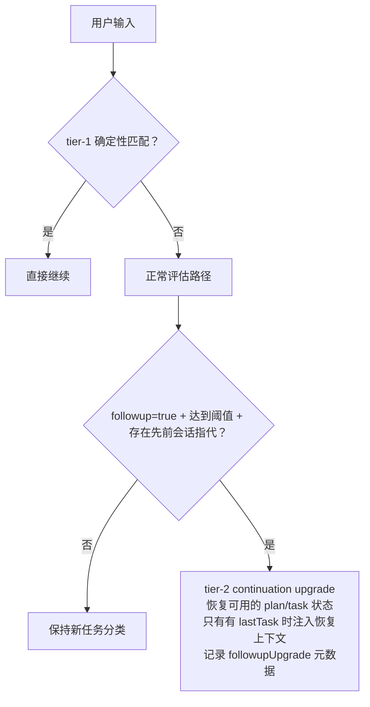

# 规划与审查

[English](../../en/guides/planning-and-review.md) | 简体中文

本指南讲解 hk2 的规划与审查机制：智能体何时创建计划、交互式确认与非交互
自动接受的区别、实时进度面板、可选的计划审查与代码审查，以及审查者无法
给出判定时会发生什么。相关环境变量默认全部**关闭**。

## 计划

由智能体决定是否规划——不存在执行前的强制计划阶段。当模型判定任务足够
复杂、适合显式拆分策略（多个独立阶段、设计选择或涉及多个子系统）时，它
调用 `plan` 工具提交：

- 一行摘要，加上
- 2–5 个有序步骤、每步 2–4 个候选策略（一个标记为推荐）的*预期形状*——
  这是提示词推荐的形状；运行时校验只强制“至少 2 个有效步骤、每步至少
  2 个有效策略”的下限，不强制上限。

简单任务完全跳过 `plan`，直接执行。

### 确认

存在交互式确认回调时，计划以菜单形式呈现：你逐步选择策略（或采纳推荐项），
并以 `{ confirmed:true, plan }` 返回定稿计划。取消菜单返回
`{ cancelled:true, ... }`，智能体自行调整。没有确认回调时，工具自动采纳推荐
策略，返回 `{ confirmed:true, plan:..., autoAccepted:true }`——这是工具接受，
不是用户确认；此模式没有用户菜单或真实进度面板。

### 进度面板

交互式计划确认后，状态栏上方固定一个实时面板：

```text
▣ Plan: 同步 README 文档与代码
  ✓ 1. 补全缺失的 plan_step 工具
  ▶ 2. 记录进度面板
    3. 修正 tree-sitter 包数量
    4. 提交并推送
```

交互模式每完成一个已确认步骤，智能体调用一次 `plan_step`；每次调用把**当前**
in_progress 步骤标记为完成并推进面板——`step` 参数虽被接受但变更时被刻意
忽略，非法、越界或乱序取值都不会导致跳步。最后一步完成后面板自动清除；
回合正常结束时还有一次收尾兜底，会清掉未被推进的面板。没有进度回调时，
`plan_step` 只确认报告，不维护进度状态或面板。从未调用 `plan` 的任务不显示
面板。

面板可跨越中断存活：中断任务状态（原始请求、摘要、计划进度）会被持久化，
`hk2 --resume` 可恢复它（见
[智能体工作流](../concepts/agent-workflow.md#中断与恢复)）。

## 计划审查

`HK2_ENABLE_PLANREVIEW=1`（默认关闭）时，用户确认计划后、执行开始前，
LLM 会对定稿计划做一次复审。复审者会：

1. 把需求重新分析为编号清单；
2. 逐点检查覆盖情况（每个需求点由哪个步骤覆盖——完整 / 部分 / 缺失）、
   步骤顺序与相互矛盾、每个所选策略的可行性、以及未声明的风险与假设；
3. 把发现的问题逐一呈现给用户确认——采纳复审建议、忽略该问题、或自定义
   解决方案。确认后的解决方案会附加到返回给智能体的计划中。

复审者的思考流以 `✎ thinking`（暗色斜体，默认上限 9 行——
`HK2_HIDE_THINKING=0` 显示全部）实时展示，随后的分析过程也实时流式。
审查开启推理且 hk2 侧不设截止时间——hk2 自身不会中断审查，但用户仍可
中止，网络故障、提供商断连或进程终止仍可能使其结束。

计划审查仅在交互式 TTY 模式下启用，且是尽力而为的：任何失败都原样返回已
确认的计划。

## 代码审查

两种形式使用相关但不同的模型解析路径：

- **自动**——`HK2_ENABLE_CODEREVIEW=1`（默认关闭）：智能体正常返回最终
  文本时，收尾逻辑可能在本轮确认或继续了计划的情况下触发审查，检查工作区
  diff、变更文件与智能体最终总结。即使模型没有为每个步骤调用 `plan_step`，
  普通最终文本也可能清理面板并触发审查。
- **手动**——`/review code` 审查原始任务请求、运行期间排队且扩展需求的指令
  以及完成结果；工具调用、推理过程和中间回合会被刻意排除。显式 `--model`
  缺失时快速失败；项目阶段引用过期时告警并使用会话模型。
  `lastCompletedTask` 快照只在内存中存在；`/session new` 与恢复都会清除它，
  恢复的会话改用确定性的 transcript 扫描。`/review plan` 为预留，尚未实现。

### UNKNOWN 判定

只有机器可读的判定 JSON 会被解析，原始内容绝不展示。无法解析出判定的
回复会被报告为 **UNKNOWN**——绝不伪装成"未发现问题"。请把 UNKNOWN 当作
"审查无结论"，而不是通过。

## 审查模型

自动审查与手动审查使用相关但不同的模型解析路径：

| 审查路径 | 项目阶段引用过期 | 显式缺失 `--model` | 选定模型调用失败 |
|---|---|---|---|
| 自动 plan/code 审查 | 静默使用会话模型 | 不适用 | 告警并跳过 |
| 手动 `/review code` | 告警并使用会话模型 | 终止 | 告警并跳过 |

自动审查把过期引用视为没有覆盖，不告警，也不产生 fallback/skip 审计事件。
解析异常则告警并使用会话模型。手动 `/review code` 对过期阶段引用和解析异常
都会告警并使用会话模型；显式 `--model=<ref>` 的引用无效或缺失时绝不回退。
选定模型成功解析后实际调用失败，会跳过审查，不再选择其他模型。


## 推理设置

- 审查始终开启推理且不设固定超时，与模型的 `--reasoning` 标志无关。
- 请求清晰度评估由 hk2 以 `enableReasoning:true` 发起；这不保证每个提供商都
  会返回独立的 reasoning 流。它是尽力而为并使用
  `HK2_LLMAPI_TIMEOUT_MS_SIMPLE`——见[环境变量](../reference/environment-variables.md)。

## 后续输入分类

hk2 使用两层分类，而不是对每条输入都运行 LLM 分类器：



`HK2_ENABLE_CONTINUATION_UPGRADE` 默认对未被 tier 1 识别的输入启用，并依赖
请求评估实际运行。`HK2_CONTINUATION_UPGRADE_MIN_CONFIDENCE` 默认 `0.6`，用
`parseFloat()` 解析并钳制到 `0–1`（非法值使用 `0.6`）。assessor 必须返回
`followup:true` 且置信度达到阈值，同时必须存在活跃 plan、`lastTask` 或会话
上下文。升级复用已有评估结果，不增加额外 LLM 调用；它只恢复实际存在的状态：
只有 pre-commit plan 存在时才恢复 `planProgress`，只有 pre-commit task 存在时才
恢复 `lastTask`，只有恢复后的 `lastTask` 非空时才注入恢复上下文。仅有历史对话时
可能升级，但不会虚构 plan、任务锚点或恢复上下文，只避免把输入提交为新的任务快照。
tier-1 快速通道会跳过评估，也不使用该升级。

## 中断行为

- `esc` 像中止任何回合阶段一样中止运行中的审查；已流出的部分分析保留在
  屏幕上，不记录判定。
- 被中断的*任务*保留计划进度；恢复后还原面板，继续指令（"continue"）注入
  任务状态使智能体继续而非重开。
- 审查失败或 UNKNOWN 绝不阻塞回合：结果被报告，本轮正常结束。

## 相关文档

- [智能体工作流](../concepts/agent-workflow.md)——审查在管线中的位置
- [模型、项目与会话](models-projects-and-sessions.md)——阶段模型
- [环境变量](../reference/environment-variables.md)——`HK2_ENABLE_PLANREVIEW`、`HK2_ENABLE_CODEREVIEW` 等
